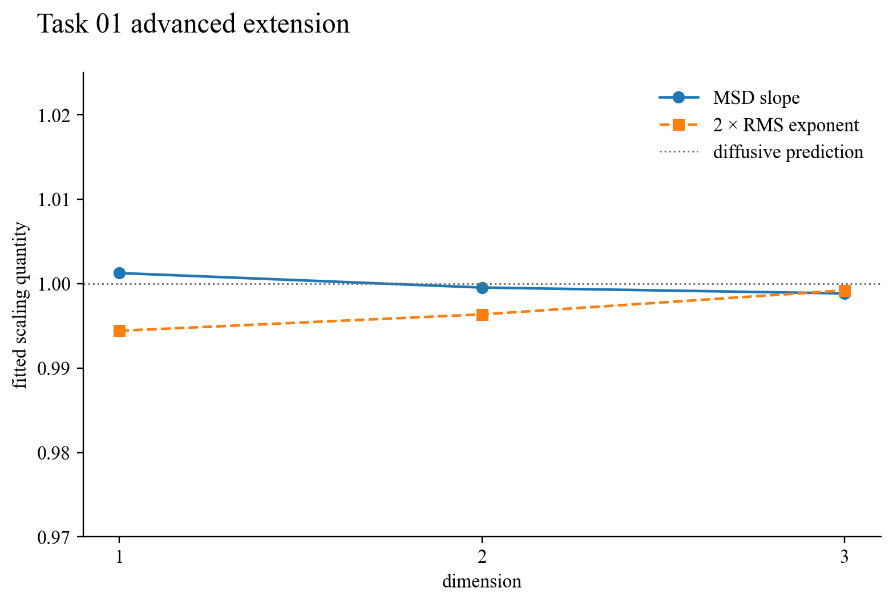

# Task 01 — Dimensional random walks

## Question

The official two-dimensional walk establishes the visual and statistical signature of diffusion. The extension asks which parts of that signature survive in one and three dimensions.

## Model and result

Every step has fixed length and an independently sampled isotropic direction. In one dimension this becomes an equal-probability left/right step; in two dimensions the angle is uniform; in three dimensions the direction is uniform on the sphere. Twelve thousand paths were used for each case. The fitted mean-square-displacement slopes were 1.00126, 0.99954 and 0.99884 in dimensions 1, 2 and 3. The corresponding RMS exponents were 0.49721, 0.49818 and 0.49960, close to the diffusive prediction (R_\mathrm{rms}\propto N^{1/2}).

Dimension therefore changes the endpoint distribution and return behaviour, but not the linear growth of mean-square displacement for independent finite-variance steps.

## Validation and limitation

The generator checks that all three dimensions are present and that the committed source validation is accepted. Seeded sampling makes the regression repeatable. This remains an ordinary Markov walk: persistence, long-range correlations, Lévy increments and absorbing boundaries would produce different scaling laws.

## Reproduce

Run `python3 -m task01_random_walk.generate_dimensional_validation`, then `python3 -m submission.generate_advanced_extensions`.

[Source module](../../task01_random_walk/dimensional_extension.py) · [Unit tests](../../task01_random_walk/test_dimensional_extension.py)
