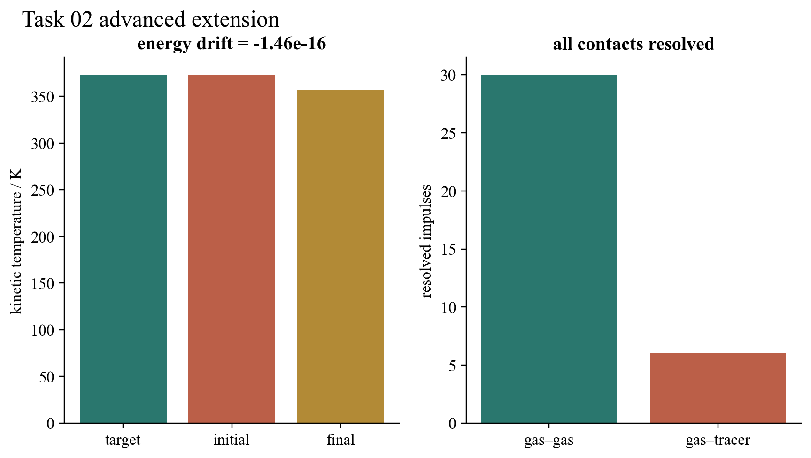

# Task 02 — A Maxwellian many-particle Brownian bath

## Question

Can irregular tracer motion emerge from a physically prepared thermal bath without periodically randomising particle directions?

## Model and result

Gas velocities are sampled from the two-dimensional Maxwell distribution and rescaled once so that their kinetic temperature is exactly 373 K. The subsequent dynamics contains no direction reset. Every detected gas–gas and gas–tracer hard-disc contact is resolved as an elastic impulse, including moving-contact timing within each step.

In the committed seeded run, 30 gas–gas impulses and 6 gas–tracer contacts occurred. Relative kinetic-energy drift was (-1.46\times10^{-16}), which is floating-point round-off rather than a physical loss. The final gas kinetic temperature was 357.1 K because energy was exchanged with the initially distinct tracer; the total kinetic energy nevertheless remained constant. The tracer moved 0.213 nm during the sampled interval.

## Validation and limitation

Regression tests independently check the target temperature, both contact classes and energy conservation. The diagnostic also confirms zero random direction resets. This is a dilute, classical, two-dimensional hard-disc gas. It is not a molecular-dynamics solvent: finite-range intermolecular potentials, viscosity calibration and three-dimensional hydrodynamics are absent.

## Reproduce

Run `python3 -m unittest task02_brownian_motion.test_thermal_bath_extension` and regenerate the shared evidence bundle.

[Source module](../../task02_brownian_motion/thermal_bath_extension.py) · [Unit tests](../../task02_brownian_motion/test_thermal_bath_extension.py)
