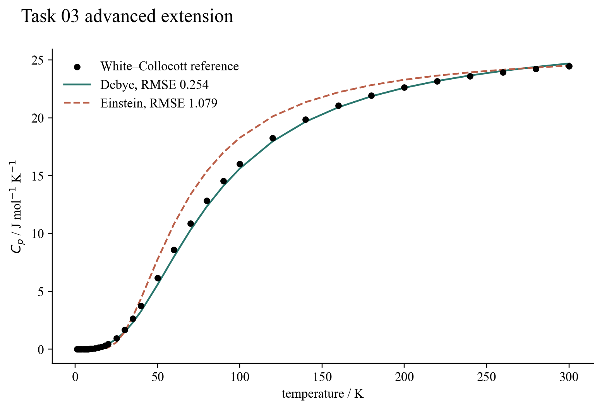

# Task 03 — Fitting copper calorimetry

## Question

The official task compares ideal Planck and Einstein functions. The extension asks whether an idealised lattice model can be confronted with real low-temperature copper measurements.

## Model and result

Thirty-five reference values from 1–300 K were transcribed from the critically evaluated copper table of White and Collocott. Two models were fitted by weighted nonlinear least squares. Both include an electronic term (\gamma T) and a small dilation correction; their lattice terms are respectively Debye and Einstein.

The Debye fit gives (\Theta_D=327.085\) K, (\gamma=5.730\times10^{-4}\ \mathrm{J\,mol^{-1}K^{-2}}), and an RMSE of 0.254 J mol⁻¹ K⁻¹. The Einstein fit gives 198.869 K and an RMSE of 1.079 J mol⁻¹ K⁻¹. Its failure is clearest at low temperature, where acoustic modes produce the Debye (T^3) law rather than a single activated oscillator scale.

## Validation and limitation

Tests check the reference-table integrity, asymptotic limits, parameter recovery and the improvement below 50 K. The conservative point uncertainties represent readable table precision; they are not the full experimental covariance, so the reported reduced chi-squared should not be interpreted as a definitive uncertainty audit.

## Source and reproduce

G. K. White and S. J. Collocott, *J. Phys. Chem. Ref. Data* **13**, 1251 (1984), DOI [10.1063/1.555728](https://doi.org/10.1063/1.555728).

Run `python3 -m unittest task03_thermal_radiation.test_experimental_fit_extension`.

[Source module](../../task03_thermal_radiation/experimental_fit_extension.py) · [Unit tests](../../task03_thermal_radiation/test_experimental_fit_extension.py)
