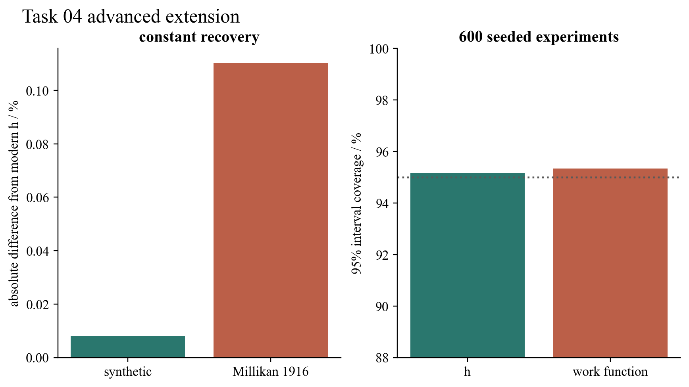

# Task 04 — Inverse photoelectric metrology

## Question

Instead of predicting stopping voltage from known constants, can noisy stopping-voltage measurements recover Planck’s constant and a material work function with defensible uncertainties?

## Model and result

The fitted relation is (V_s=(h/e)f-\phi/e). Weighted least squares returns the slope, intercept and their covariance; these are transformed into (h), (\phi), standard errors and a covariance-aware confidence interval. A seeded ensemble of 600 synthetic experiments tests the full inverse pipeline.

The mean recovered Planck constant had a relative bias of only (8.01\times10^{-5}), while the nominal 95% interval contained the true value in 95.17% of experiments. Work-function coverage was 95.33%. As an independent historical check, the unweighted mean of Millikan’s nine Table II values gives (6.61877\times10^{-34}\) J s when multiplied by the modern elementary charge, 0.110% below the modern value.

## Validation and limitation

The tests require small Monte Carlo bias, more than 90% interval coverage and historical agreement within 1%. The synthetic errors are independent Gaussian voltage errors. Real experiments can also contain contact potentials, correlated calibration drift, uncertain frequency and outliers; those would require an errors-in-variables or hierarchical model.

## Source and reproduce

R. A. Millikan, *Physical Review* **7**, 355–388 (1916), DOI [10.1103/PhysRev.7.355](https://doi.org/10.1103/PhysRev.7.355).

Run `python3 -m unittest task04_photoelectric_effect.test_measurement_extension`.

[Source module](../../task04_photoelectric_effect/measurement_extension.py) · [Unit tests](../../task04_photoelectric_effect/test_measurement_extension.py)
