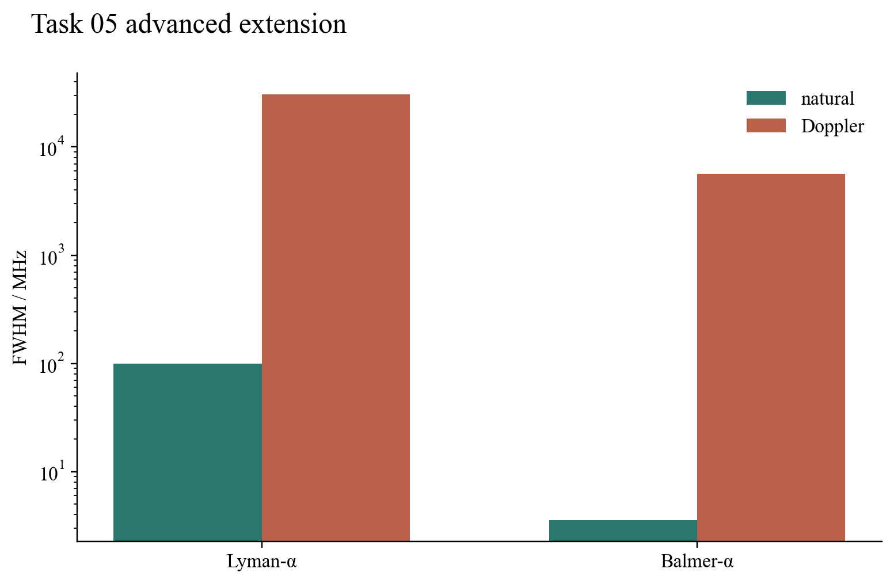

# Task 05 — Precision hydrogen spectroscopy

## Question

The Bohr model locates spectral series. What additional physics determines fine splittings, transition strength and the finite width of an observed line?

## Model and result

Point-Coulomb Dirac binding energies are evaluated with the electron–proton reduced mass. An explicitly labelled pedagogical Lamb-shift scale anchors the 2s correction at 1057.844 MHz and applies the leading (n^{-3}) trend only to s states. Electric-dipole selection rules, hydrogenic radial integrals and shell-averaged angular strength then give Einstein (A) coefficients. Natural and thermal Doppler widths are combined with a Voigt-width approximation.

For Lyman-α the model gives 121.56684 nm and (A=6.265\times10^8\ \mathrm{s^{-1}}), reproducing the standard scale. Its natural FWHM is 99.7 MHz, compared with a 30.5 GHz Doppler width under the chosen thermal condition. Balmer-α is predicted at 656.454 nm, with Doppler width 5.64 GHz. Thus instrumental and thermal context can matter more to the observed profile than the lifetime width.

## Validation and limitation

Tests anchor the Lyman wavelength and rate, require positive fine structure, and verify that the displayed thermal width exceeds the natural width. The Lamb term is not a bound-state QED computation; hyperfine structure, pressure broadening and external fields are omitted.

## Source and reproduce

Selection-rule conventions follow the [NIST Atomic Spectroscopy Compendium](https://www.nist.gov/pml/atomic-spectroscopy-compendium-basic-ideas-notation-data-and-formulas/atomic-spectroscopy).

Run `python3 -m unittest task05_hydrogen_spectrum.test_precision_spectroscopy_extension`.

[Source module](../../task05_hydrogen_spectrum/precision_spectroscopy_extension.py) · [Unit tests](../../task05_hydrogen_spectrum/test_precision_spectroscopy_extension.py)
