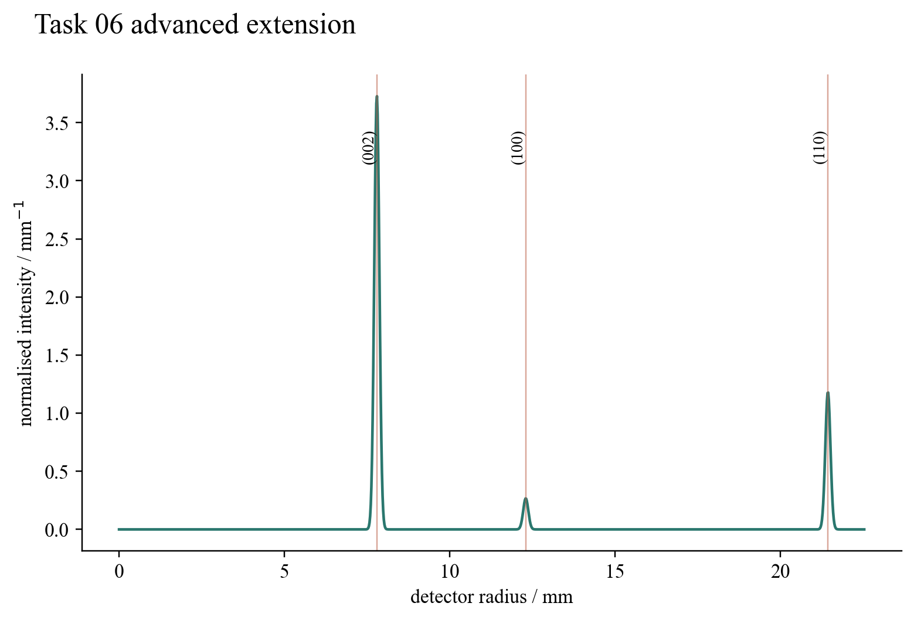

# Task 06 — Graphite ring intensity and width

## Question

The official geometry predicts where electron-diffraction rings appear. Why are some rings bright, others absent, and every real ring finitely wide?

## Model and result

The extension represents graphite by a hexagonal cell with (a=0.246\) nm, (c=0.671\) nm and a four-atom AB basis. The coherent basis sum supplies the structure factor. Hexagonal reflection multiplicity and a Debye–Waller factor determine relative powder intensity. A Scherrer crystallite term is then combined in quadrature with beam divergence, accelerating-voltage spread and detector resolution to produce radial FWHM.

At the committed geometry, three displayed allowed reflections form a profile whose numerical area is one. The first official spacings are recovered within their regression tolerances, and all peaks have positive finite width. The resulting curve is therefore a detector-level prediction rather than an overlay of infinitely thin circles.

## Validation and limitation

Unit tests independently verify the (100) and (110) spacings, forbidden/allowed structure-factor behaviour, profile normalisation and finite widths. This is kinematic powder diffraction. It does not include multiple dynamical scattering, a calibrated electron atomic-form-factor table, preferred orientation or inelastic background, all of which would be needed for quantitative specimen refinement.

## Reproduce

Run `python3 -m unittest task06_electron_diffraction.test_intensity_extension`.

[Source module](../../task06_electron_diffraction/intensity_extension.py) · [Unit tests](../../task06_electron_diffraction/test_intensity_extension.py)
