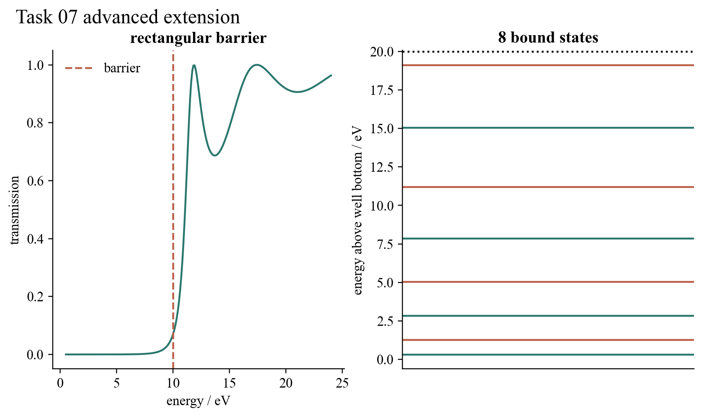

# Task 07 — Finite confinement, tunnelling and revival

## Question

How do the infinite-box conclusions change when walls have a finite height and the particle starts as a localised wave packet rather than an energy eigenstate?

## Model and result

Even and odd bound states of a centred finite square well are obtained from their transcendental matching equations. Their analytic wavefunctions include exponentially decaying exterior tails and are normalised over the whole line. A separate exact rectangular-barrier expression covers energies below, at and above the barrier. Finally, a Gaussian packet is projected onto 180 exact infinite-box states and evolved by their phase factors.

For a 1 nm, 20 eV well, eight bound states lie below the barrier; the ground state is 0.31794 eV above the bottom. A 1 nm electron box has a full revival time of 10.9982 fs. At that time the computed overlap with the initial packet is unity within the numerical tolerance, while intermediate times show interference and spreading. Below-barrier transmission remains non-zero and rises toward the barrier height.

## Validation and limitation

Tests check state ordering and parity, wavefunction normalisation and boundary continuity, bounded transmission, exponential width dependence, packet norm and revival. The potential is one-dimensional and closed. Decoherence, time-dependent driving, realistic surface potentials and many-particle occupation are not included.

## Reproduce

Run `python3 -m unittest task07_particle_in_box.test_finite_well_extension`.

[Source module](../../task07_particle_in_box/finite_well_extension.py) · [Unit tests](../../task07_particle_in_box/test_finite_well_extension.py)
