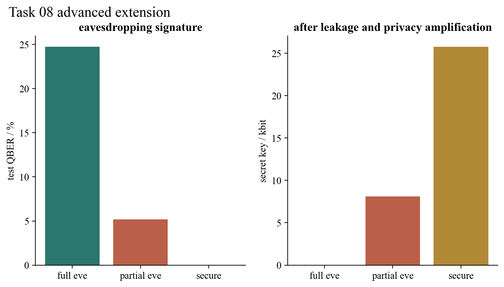

# Task 08 — Finite-key BB84

## Question

The official polarisation probabilities demonstrate basis mismatch. How does that physics become a complete finite sequence of sifting, eavesdropper detection and secret-key compression?

## Model and result

Seeded prepare-and-measure trials generate Alice’s bits and bases, optional intercept–resend choices for Eve, Bob’s detections, loss and dark-count hooks. Matching bases are sifted; a random subset estimates QBER. The remaining length is reduced by an idealised reconciliation-leakage term and a finite-size phase-error bound. A seeded Toeplitz hash performs privacy amplification and the independently produced Alice/Bob keys are compared.

With 80,000 transmitted signals the no-Eve scenario yields 39,897 sifted bits and a 25,741-bit matching secret key. At 20% intercept probability, the test QBER is 5.18% and 8,098 secret bits remain after compression. Full intercept–resend produces 24.73% QBER, close to the ideal 25% signature, and the protocol aborts with zero secret bits.

## Validation and limitation

Tests cover seeded reproducibility, sifting, the quarter-QBER benchmark, full-Eve abort, partial-Eve key agreement, dark-count/loss behaviour and Toeplitz dimensions. The finite-size expression is deliberately pedagogical: it is not a composable security proof and does not cover detector side channels, decoy states or coherent attacks.

## Reproduce

Run `python3 -m unittest task08_quantum_cryptography.test_bb84_extension`.

[Source module](../../task08_quantum_cryptography/bb84_extension.py) · [Unit tests](../../task08_quantum_cryptography/test_bb84_extension.py)
