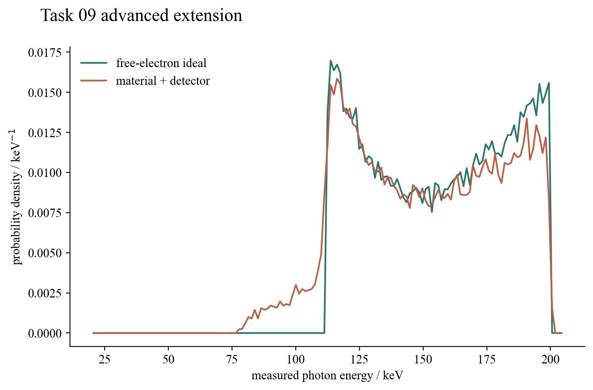

# Task 09 — Compton material and detector response

## Question

The exact free-electron collision fixes outgoing energy at a chosen angle. What distribution appears when angles follow the Klein–Nishina law and photons pass through matter and a detector?

## Model and result

Scattering directions are sampled by vectorised rejection from the unpolarised Klein–Nishina differential cross section. The ideal free-electron energy is then modified by effective binding-energy and Doppler terms, an optional second scattering, and Gaussian detector resolution. The ideal and response-layer simulations use fixed seeds and common histogram bins.

In the committed sample, the ideal spectrum has mean 156.40 keV and standard deviation 27.61 keV. The material-plus-detector spectrum has mean 150.70 keV and standard deviation 29.90 keV; 18.44% of events undergo the optional second scattering. The extension therefore produces both expected qualitative effects: a lower mean after additional energy loss and a broader measured distribution.

## Validation and limitation

Tests check the rejection sampler against a numerical Klein–Nishina angular moment, enforce energy bounds, verify zero-width recovery, confirm reproducibility and require the response layer to broaden the spectrum. This remains an effective response model, not a Geant4 transport calculation. Material-specific shell cross sections, fluorescence, detector escape peaks and full geometry are outside scope.

## Reproduce

Run `python3 -m unittest task09_compton_scattering.test_detector_extension`.

[Source module](../../task09_compton_scattering/detector_extension.py) · [Unit tests](../../task09_compton_scattering/test_detector_extension.py)
