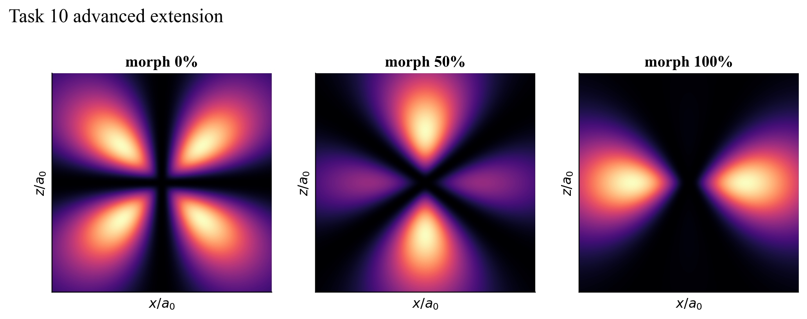

# Task 10 — From orbitals to hybrids, molecules and atoms

## Question

The official explorer displays stationary one-electron hydrogenic orbitals. What new structures appear when states are superposed, atomic orbitals hybridise, or several electrons are approximated together?

## Model and result

The first layer builds normalised real-(m) coefficient paths across a five-state (d) family. Every displayed frame changes the wavefunction coefficients; it is not a rotated camera view. The second layer constructs orthonormal sp, sp² and sp³ coefficient sets. The third uses the analytic 1s–1s overlap for an H₂⁺ LCAO bonding/antibonding pair. The fourth sums Slater-screened hydrogenic subshell densities for He, Li, C and Ne.

All 41 morph frames remain normalised. Maximum hybrid orthogonality errors are between zero and (3.11\times10^{-16}). The H₂⁺ overlap falls from one at coincident centres to 0.0102 at (8a_0), as required for separated atoms. Integrated spherical densities recover 2, 3, 6 and 10 electrons respectively; the largest numerical electron-count error is below (4\times10^{-10}).

## Validation and limitation

Tests check superposition endpoints and normalisation, every hybrid Gram matrix, molecular symmetry and overlap limits, and numerical electron-count integrals. The morph coordinate is an externally driven visual parameter, not free time evolution. H₂⁺ is a one-electron LCAO model, while the neutral atoms use independent screened orbitals and contain no explicit electron correlation.

## Reproduce

Run `python3 -m unittest task10_hydrogenic_orbitals.test_molecular_hybrid_extension`.

[Source module](../../task10_hydrogenic_orbitals/molecular_hybrid_extension.py) · [Unit tests](../../task10_hydrogenic_orbitals/test_molecular_hybrid_extension.py)
