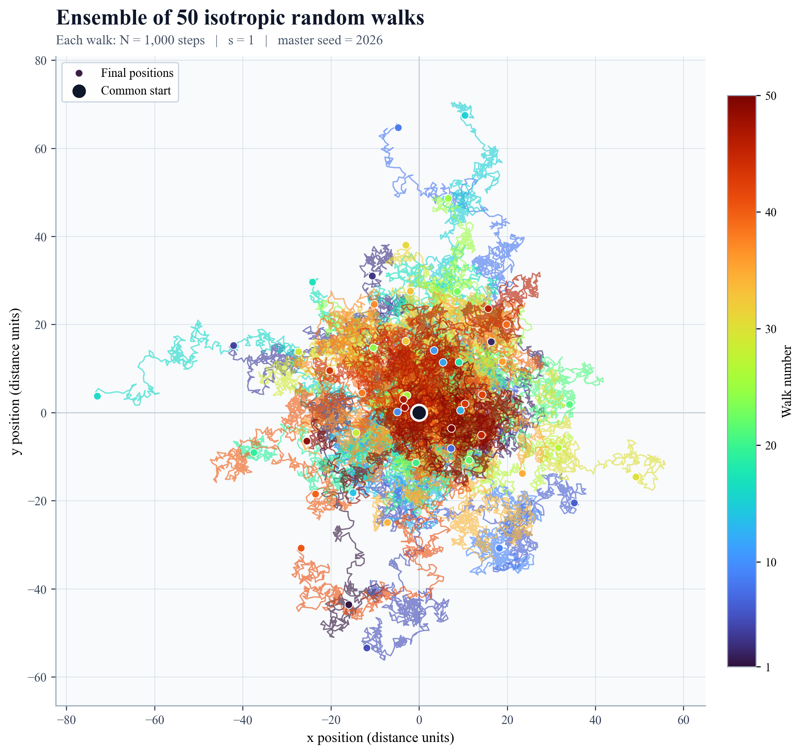
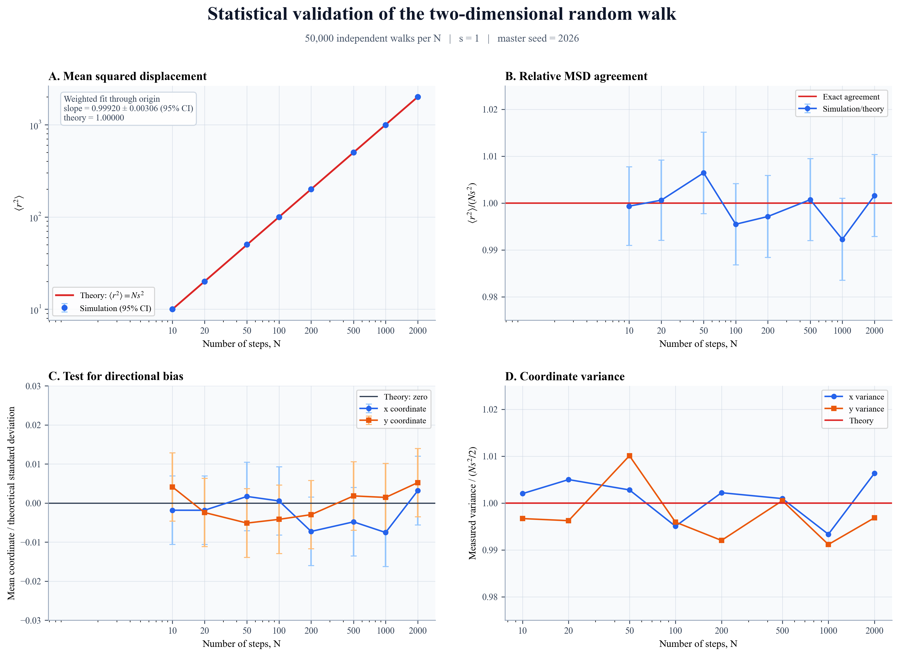
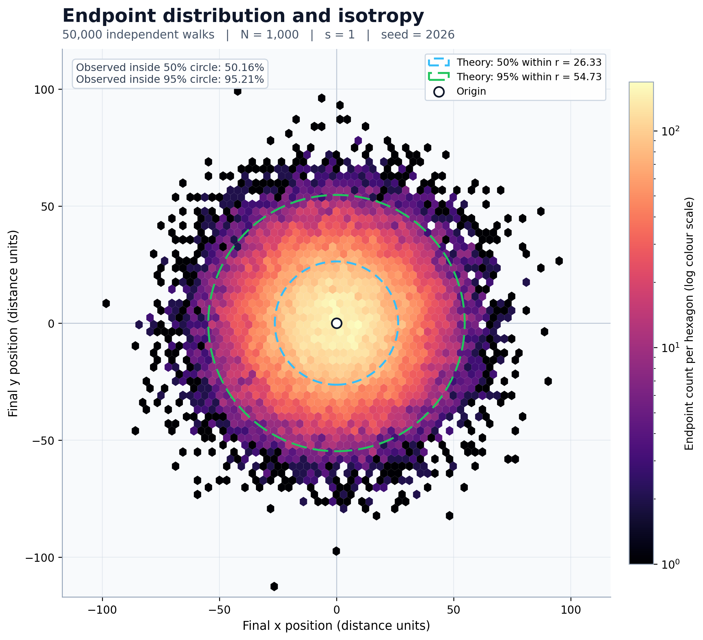
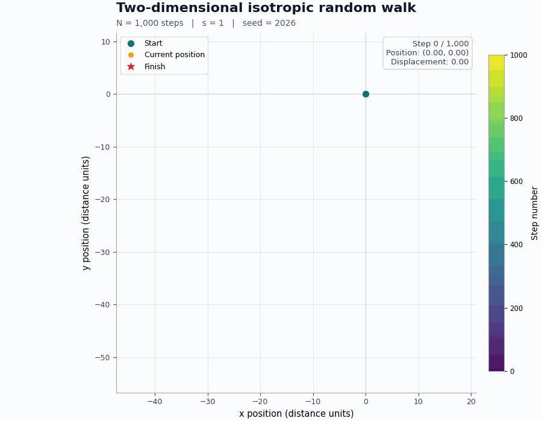

# Task 1: Two-Dimensional Random Walk

## Objective

Model a random walk consisting of $N$ steps of fixed length $s$. Each step
must point in a random direction. Its angle from the positive horizontal axis is
selected independently from a uniform distribution between $0$ and $2\pi$
radians.

This document defines the mathematical model, explains its implementation, and
tests the Python simulation against analytical predictions.

## Variables

| Symbol | Meaning |
| :---: | --- |
| $N$ | Total number of steps |
| $s$ | Fixed length of every step |
| $i$ | Step number, from $1$ to $N$ |
| $\theta_i$ | Random direction of step $i$, in radians |
| $(x_i, y_i)$ | Position after step $i$ |
| $r_i$ | Distance from the starting point after step $i$ |

The particle begins at the origin:

$$
(x_0, y_0)=(0, 0).
$$

## Model assumptions

1. The walk takes place in an unbounded two-dimensional plane.
2. Every step has exactly the same length $s$.
3. The direction of each step is independent of all previous directions.
4. Every direction is equally likely. In mathematical terms, each
   $\theta_i$ is sampled uniformly from the interval $[0, 2\pi)$.

5. There is no drift, preferred direction, boundary, force, or interaction.
6. The model is discrete: position changes once per step.

## One step of the walk

The displacement vector for step $i$ is

$$
\Delta\mathbf r_i=s(\cos\theta_i,\sin\theta_i).
$$

Therefore, its horizontal and vertical components are

$$
\begin{aligned}
\Delta x_i &= s\cos\theta_i, \\
\Delta y_i &= s\sin\theta_i.
\end{aligned}
$$

The position is updated using

$$
\begin{aligned}
x_i &= x_{i-1}+s\cos\theta_i, \\
y_i &= y_{i-1}+s\sin\theta_i.
\end{aligned}
$$

This construction guarantees that every step has length $s$, because

$$
\sqrt{(\Delta x_i)^2+(\Delta y_i)^2}
=s\sqrt{\cos^2\theta_i+\sin^2\theta_i}
=s.
$$

Choosing horizontal and vertical increments independently would not preserve a
fixed step length, so the random angle must be generated first.

## Position after multiple steps

After $n$ steps, the coordinates are the cumulative sums

$$
\begin{aligned}
x_n &= s\sum_{i=1}^{n}\cos\theta_i, \\
y_n &= s\sum_{i=1}^{n}\sin\theta_i.
\end{aligned}
$$

The displacement from the origin is

$$
r_n=\sqrt{x_n^2+y_n^2}.
$$

## Theoretical predictions

### 1. No preferred direction

For an angle uniformly distributed between $0$ and $2\pi$,

$$
\begin{aligned}
\langle\cos\theta\rangle &= 0, \\
\langle\sin\theta\rangle &= 0.
\end{aligned}
$$

It follows that, over a large ensemble of independent walks,

$$
\begin{aligned}
\langle x_n\rangle &= 0, \\
\langle y_n\rangle &= 0.
\end{aligned}
$$

This does not mean that every walk finishes at the origin. It means that the
endpoints of many walks are centred on the origin and have no preferred
direction.

### 2. Spread in each coordinate

The angular averages are

$$
\langle\cos^2\theta\rangle
=\langle\sin^2\theta\rangle
=\frac{1}{2}.
$$

Because successive directions are independent, cross terms average to zero.
The coordinate variances after $n$ steps are therefore

$$
\begin{aligned}
\mathrm{Var}(x_n) &= \frac{ns^2}{2}, \\
\mathrm{Var}(y_n) &= \frac{ns^2}{2}.
\end{aligned}
$$

### 3. Mean squared displacement

Since $r_n^2=x_n^2+y_n^2$,

$$
\langle r_n^2\rangle
=\langle x_n^2\rangle+\langle y_n^2\rangle
=\frac{ns^2}{2}+\frac{ns^2}{2}.
$$

The central prediction is therefore

$$
\boxed{\langle r_n^2\rangle=ns^2}.
$$

At the end of a walk of $N$ steps,

$$
\boxed{\langle r_N^2\rangle=Ns^2}.
$$

The root-mean-square displacement is

$$
\boxed{r_{\mathrm{RMS}}=\sqrt{\langle r_N^2\rangle}=s\sqrt{N}}.
$$

The RMS displacement is not the same as the mean distance
$\langle r_N\rangle$. This distinction will be preserved in the analysis.

### 4. Endpoint distribution after many steps

For a sufficiently large number of steps, the central limit theorem predicts
that the endpoint coordinates are approximately normally distributed:

$$
\begin{aligned}
x_N &\approx \mathcal N\left(0,\frac{Ns^2}{2}\right), \\
y_N &\approx \mathcal N\left(0,\frac{Ns^2}{2}\right).
\end{aligned}
$$

The two-dimensional endpoint cloud should therefore be rotationally symmetric
and centred at the origin. The radial distance is approximately Rayleigh
distributed with scale parameter

$$
\sigma=s\sqrt{\frac{N}{2}}.
$$

This is an additional prediction for assessing the endpoint-distribution plot.

## Numerical success criteria

The completed simulation must demonstrate that:

1. every individual step has length $s$, within floating-point precision;
2. the sampled directions show no preferred angle;
3. ensemble averages of $x_N$ and $y_N$ are statistically consistent with
   zero;
4. the endpoint cloud is centred and rotationally symmetric;
5. measured mean squared displacement agrees with $Ns^2$, within statistical
   uncertainty;
6. RMS displacement scales as $s\sqrt{N}$.

These checks distinguish a physically correct random-walk model from a graph
that merely appears random.

## Basic simulation implementation

The mathematical model is implemented in `random_walk.py`. It generates one
walk, stores the origin and every subsequent position, and performs
deterministic consistency checks before any plotting or statistical analysis is
added.

Run the basic simulation from the repository root:

```bash
python3 task01_random_walk/random_walk.py --steps 1000 --step-size 1 --seed 2026
```

The seed is optional. Supplying one makes the walk exactly reproducible;
omitting it generates a new walk each time.

Run the automated tests with:

```bash
python3 -m unittest discover -s task01_random_walk -p 'test_*.py' -v
```

The tests verify input validation, array dimensions, inclusion of the origin,
the angular interval, fixed step length, cumulative positions, reproducibility,
and command-line behaviour. Separate tests cover the ensemble statistics,
figures, and animation described below.

## Computational method

The numerical method follows the equations directly:

1. NumPy's random-number generator samples $N$ independent angles from the
   half-open interval $[0,2\pi)$.
2. Each angle is converted into the fixed-length displacement
   $s(\cos\theta_i,\sin\theta_i)$.
3. A cumulative sum of the displacement vectors produces all positions from
   $(x_1,y_1)$ to $(x_N,y_N)$; the origin is stored separately as
   $(x_0,y_0)$.
4. Deterministic validation checks the array shapes, origin, angle range,
   finite values, cumulative positions, final displacement, and length of
   every step before a result is used.
5. For statistical experiments, complete paths are unnecessary. Walks are
   processed in batches and only their endpoints are retained, allowing large
   ensembles to be tested without excessive memory use.

The core model is in [`random_walk.py`](random_walk.py), while
[`statistical_analysis.py`](statistical_analysis.py) contains the independent
large-sample analysis. A seed makes an experiment exactly reproducible, but it
does not alter the probability distribution being sampled. Changing the seed
changes the particular paths while preserving the same theoretical
predictions.

## Single-walk figure

Generate the reference figure with:

```bash
python3 -m task01_random_walk.plot_single_walk \
  --steps 1000 --step-size 1 --seed 2026
```

This produces a high-resolution PNG for convenient viewing and an SVG for
resolution-independent presentation. Path colour shows the progression from
the first to the final step. The start, finish, final displacement, parameters,
and step number are labelled, and the horizontal and vertical axes use equal
scales to prevent geometric distortion.


## Fifty-walk ensemble

The official Challenge Presentation illustrates Task 1 by overlaying about 50
walks with the same step size. Generate our reproducible version with:

```bash
python3 -m task01_random_walk.plot_walk_ensemble \
  --walks 50 --steps 1000 --step-size 1 --seed 2026
```

All 50 trajectories begin at the origin and independently sample their step
directions from the same uniform angular distribution. Each trajectory has its
own colour, its final position is marked, and equal axis scales preserve the
true geometry. This figure demonstrates the variety of outcomes produced by
identical model parameters; formal statistical tests follow separately.



## Statistical validation against theory

A random-looking path is not sufficient evidence that the model is correct. We
therefore tested the theoretical predictions using 50,000 independent walks at
each of eight step counts:

$$
N = 10, 20, 50, 100, 200, 500, 1000, 2000.
$$

This corresponds to 400,000 complete walks and 194 million independently
sampled steps. Reproduce the analysis with:

```bash
python3 -m task01_random_walk.statistical_analysis \
  --walks 50000 --step-size 1 --seed 2026 \
  --step-counts 10 20 50 100 200 500 1000 2000 \
  --reference-steps 1000
```

### Main results

| Test | Theoretical prediction | Simulation result |
| --- | --- | --- |
| Weighted MSD slope | $1.00000$ | $0.99920\pm0.00306$ (95% confidence) |
| Mean endpoint coordinates | Zero | Every 95% confidence interval includes zero |
| Coordinate variances | $Ns^2/2$ | Maximum relative difference: 1.01% |
| Mean squared displacement | $Ns^2$ | Maximum relative difference: 0.77% |
| Endpoints inside theoretical 50% radius | 50% | 50.16% |
| Endpoints inside theoretical 95% radius | 95% | 95.21% |

The fitted MSD slope includes the theoretical value within its 95% confidence
interval. The absence of significant mean displacement in either coordinate,
the agreement of both coordinate variances, and the circular endpoint cloud all
support the conclusion that the simulation is isotropic and unbiased.



For $N=1000$, the central limit theorem predicts an approximately circular
two-dimensional endpoint distribution. The measured cloud has no preferred
direction and closely matches the theoretical radial containment probabilities.



The exact numerical values, uncertainty estimates, and theoretical comparisons
are available in [`data/task01/statistical_results.csv`](../data/task01/statistical_results.csv).

## Presentation animation

The animation uses the same reproducible 1,000-step walk as the single-walk
figure. It keeps the axes fixed and equal throughout, colours the completed path
by step number, displays the current coordinates and displacement, and holds the
final frame long enough to inspect the result.

Generate the animation with:

```bash
python3 -m task01_random_walk.animate_random_walk \
  --steps 1000 --step-size 1 --seed 2026
```

The 1,000-step trajectory is sampled into a compact set of animation frames;
the numerical simulation itself still contains and calculates every step.



## Discussion and interpretation

### What one trajectory shows

The reference trajectory takes 1,000 steps of length 1 and finishes at

$$
(x_{1000},y_{1000})=(-15.93,-43.61),
$$

giving a final displacement of approximately 46.43 units. Its total travelled
distance and theoretical RMS displacement are very different quantities:

$$
L_{\mathrm{path}}=Ns=1000,
\qquad
r_{\mathrm{RMS}}=s\sqrt{N}=\sqrt{1000}\approx31.62.
$$

The final displacement is only about 4.64% of the total path length because
steps in different directions repeatedly cancel. Its value is larger than the
theoretical RMS value, but this is not a disagreement: $r_{\mathrm{RMS}}$ is an
ensemble statistic, not the distance that every individual walk must reach.

The irregular loops and excursions in the figure are therefore expected. A
single trajectory demonstrates the construction and fixed step length, but it
cannot by itself establish isotropy or verify an average law. Those claims
require many independent walks.

### What the ensemble establishes

The 50-walk figure shows that identical parameters can produce visibly
different trajectories and endpoints. The larger 50,000-walk experiments then
provide quantitative evidence:

- every confidence interval for the mean $x$ and $y$ endpoint contains zero,
  so there is no statistically resolved drift;
- the two coordinate variances agree with $Ns^2/2$ to within 1.01%, supporting
  equal spreading in perpendicular directions;
- the MSD agrees with $Ns^2$ to within 0.77% across all tested values of $N$;
- the fitted MSD slope, $0.99920\pm0.00306$, contains the theoretical value 1
  within its 95% confidence interval; and
- the measured 50% and 95% radial containment fractions are 50.16% and 95.21%,
  closely matching the approximately Rayleigh endpoint distribution.

The individual MSD measurements fluctuate both above and below theory, as
finite samples should. Their small, unsystematic deviations and the confidence
interval on the fitted slope provide stronger evidence than visual similarity
alone.

### Meaning of the square-root law

The total distance travelled increases linearly as $Ns$, but independent
directions cause cancellation in the net displacement. Consequently, the
typical displacement grows only as

$$
r_{\mathrm{RMS}}=s\sqrt{N}.
$$

Doubling the number of steps therefore multiplies the RMS displacement by
$\sqrt{2}$, not 2; four times as many steps are needed to double it. This is the
central physical behaviour of an unbiased random walk and is the reason its
mean squared displacement is proportional to $N$.

### Reliability and limitations

The deterministic validation found a maximum step-length error of
$1.11\times10^{-16}$ for the reference walk, which is at the level expected
from floating-point arithmetic. Statistical conclusions are reported with 95%
confidence intervals, and all figures and data can be regenerated from the
documented commands and seeds.

The model nevertheless has deliberate limits:

- it represents an unbounded, two-dimensional plane;
- all steps have the same length and all directions are independent;
- it contains no boundary, drift, force, interaction, or directional
  correlation;
- a step is an abstract discrete index unless a physical time per step is
  specified;
- its random numbers are pseudorandom, although suitable for this numerical
  experiment; and
- the normal and Rayleigh endpoint distributions are large-$N$ approximations,
  whereas $\langle r_N^2\rangle=Ns^2$ follows exactly from the model
  assumptions.

These limitations define the scope of the result rather than errors in the
implementation. Adding any excluded effect would create a different model and
would require new theoretical predictions for comparison.

## Conclusion

The simulation satisfies the Task 1 definition: it constructs $N$ independent
two-dimensional steps of fixed length $s$ with uniformly random directions.
Direct numerical checks confirm the required geometry, and large ensembles
show zero drift, equal coordinate spreading, a circular endpoint distribution,
and the predicted linear relation $\langle r_N^2\rangle=Ns^2$. The agreement
between derivation, implementation, automated tests, and measured uncertainty
supports the conclusion that the model is both computationally correct and
statistically consistent with an isotropic random walk.
