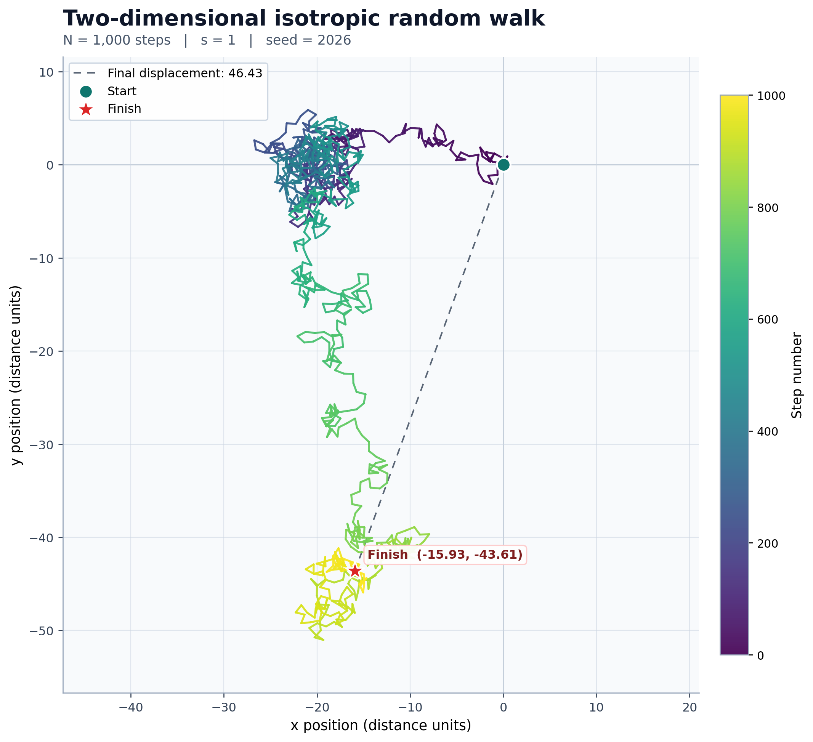

# Task 1: Two-Dimensional Random Walk

## Objective

Model a random walk consisting of $N$ steps of fixed length $s$. Each step
must point in a random direction. Its angle from the positive horizontal axis is
selected independently from a uniform distribution between $0$ and $2\pi$
radians.

This document defines the mathematical model and the predictions that the
Python simulation must reproduce.

## Variables

| Symbol | Meaning |
| :---: | --- |
| $N$ | Total number of steps |
| $s$ | Fixed length of every step |
| $i$ | Step number, from $1$ to $N$ |
| $\theta_i$ | Random direction of step $i$, in radians |
| $(x_i, y_i)$ | Position after step $i$ |
| $r_i$ | Distance from the starting point after step $i$ |

The particle begins at the origin:

$$
(x_0, y_0)=(0, 0).
$$

## Model assumptions

1. The walk takes place in an unbounded two-dimensional plane.
2. Every step has exactly the same length $s$.
3. The direction of each step is independent of all previous directions.
4. Every direction is equally likely. In mathematical terms, each
   $\theta_i$ is sampled uniformly from the interval $[0, 2\pi)$.

5. There is no drift, preferred direction, boundary, force, or interaction.
6. The model is discrete: position changes once per step.

## One step of the walk

The displacement vector for step $i$ is

$$
\Delta\mathbf r_i=s(\cos\theta_i,\sin\theta_i).
$$

Therefore, its horizontal and vertical components are

$$
\begin{aligned}
\Delta x_i &= s\cos\theta_i, \\
\Delta y_i &= s\sin\theta_i.
\end{aligned}
$$

The position is updated using

$$
\begin{aligned}
x_i &= x_{i-1}+s\cos\theta_i, \\
y_i &= y_{i-1}+s\sin\theta_i.
\end{aligned}
$$

This construction guarantees that every step has length $s$, because

$$
\sqrt{(\Delta x_i)^2+(\Delta y_i)^2}
=s\sqrt{\cos^2\theta_i+\sin^2\theta_i}
=s.
$$

Choosing horizontal and vertical increments independently would not preserve a
fixed step length, so the random angle must be generated first.

## Position after multiple steps

After $n$ steps, the coordinates are the cumulative sums

$$
\begin{aligned}
x_n &= s\sum_{i=1}^{n}\cos\theta_i, \\
y_n &= s\sum_{i=1}^{n}\sin\theta_i.
\end{aligned}
$$

The displacement from the origin is

$$
r_n=\sqrt{x_n^2+y_n^2}.
$$

## Theoretical predictions

### 1. No preferred direction

For an angle uniformly distributed between $0$ and $2\pi$,

$$
\begin{aligned}
\langle\cos\theta\rangle &= 0, \\
\langle\sin\theta\rangle &= 0.
\end{aligned}
$$

It follows that, over a large ensemble of independent walks,

$$
\begin{aligned}
\langle x_n\rangle &= 0, \\
\langle y_n\rangle &= 0.
\end{aligned}
$$

This does not mean that every walk finishes at the origin. It means that the
endpoints of many walks are centred on the origin and have no preferred
direction.

### 2. Spread in each coordinate

The angular averages are

$$
\langle\cos^2\theta\rangle
=\langle\sin^2\theta\rangle
=\frac{1}{2}.
$$

Because successive directions are independent, cross terms average to zero.
The coordinate variances after $n$ steps are therefore

$$
\begin{aligned}
\mathrm{Var}(x_n) &= \frac{ns^2}{2}, \\
\mathrm{Var}(y_n) &= \frac{ns^2}{2}.
\end{aligned}
$$

### 3. Mean squared displacement

Since $r_n^2=x_n^2+y_n^2$,

$$
\langle r_n^2\rangle
=\langle x_n^2\rangle+\langle y_n^2\rangle
=\frac{ns^2}{2}+\frac{ns^2}{2}.
$$

The central prediction is therefore

$$
\boxed{\langle r_n^2\rangle=ns^2}.
$$

At the end of a walk of $N$ steps,

$$
\boxed{\langle r_N^2\rangle=Ns^2}.
$$

The root-mean-square displacement is

$$
\boxed{r_{\mathrm{RMS}}=\sqrt{\langle r_N^2\rangle}=s\sqrt{N}}.
$$

The RMS displacement is not the same as the mean distance
$\langle r_N\rangle$. This distinction will be preserved in the analysis.

### 4. Endpoint distribution after many steps

For a sufficiently large number of steps, the central limit theorem predicts
that the endpoint coordinates are approximately normally distributed:

$$
\begin{aligned}
x_N &\approx \mathcal N\left(0,\frac{Ns^2}{2}\right), \\
y_N &\approx \mathcal N\left(0,\frac{Ns^2}{2}\right).
\end{aligned}
$$

The two-dimensional endpoint cloud should therefore be rotationally symmetric
and centred at the origin. The radial distance is approximately Rayleigh
distributed with scale parameter

$$
\sigma=s\sqrt{\frac{N}{2}}.
$$

This is an additional prediction for assessing the endpoint-distribution plot.

## Numerical success criteria

The completed simulation must demonstrate that:

1. every individual step has length $s$, within floating-point precision;
2. the sampled directions show no preferred angle;
3. ensemble averages of $x_N$ and $y_N$ are statistically consistent with
   zero;
4. the endpoint cloud is centred and rotationally symmetric;
5. measured mean squared displacement agrees with $Ns^2$, within statistical
   uncertainty;
6. RMS displacement scales as $s\sqrt{N}$.

These checks distinguish a physically correct random-walk model from a graph
that merely appears random.

## Basic simulation implementation

The mathematical model is implemented in `random_walk.py`. It generates one
walk, stores the origin and every subsequent position, and performs
deterministic consistency checks before any plotting or statistical analysis is
added.

Run the basic simulation from the repository root:

```bash
python3 task01_random_walk/random_walk.py --steps 1000 --step-size 1 --seed 2026
```

The seed is optional. Supplying one makes the walk exactly reproducible;
omitting it generates a new walk each time.

Run the automated tests with:

```bash
python3 -m unittest discover -s task01_random_walk -p 'test_*.py' -v
```

The tests verify input validation, array dimensions, inclusion of the origin,
the angular interval, fixed step length, cumulative positions, reproducibility,
and command-line behaviour. Ensemble statistics and presentation graphics are
handled in later stages.

## Single-walk figure

Generate the reference figure with:

```bash
python3 -m task01_random_walk.plot_single_walk \
  --steps 1000 --step-size 1 --seed 2026
```

This produces a high-resolution PNG for convenient viewing and an SVG for
resolution-independent presentation. Path colour shows the progression from
the first to the final step. The start, finish, final displacement, parameters,
and step number are labelled, and the horizontal and vertical axes use equal
scales to prevent geometric distortion.


